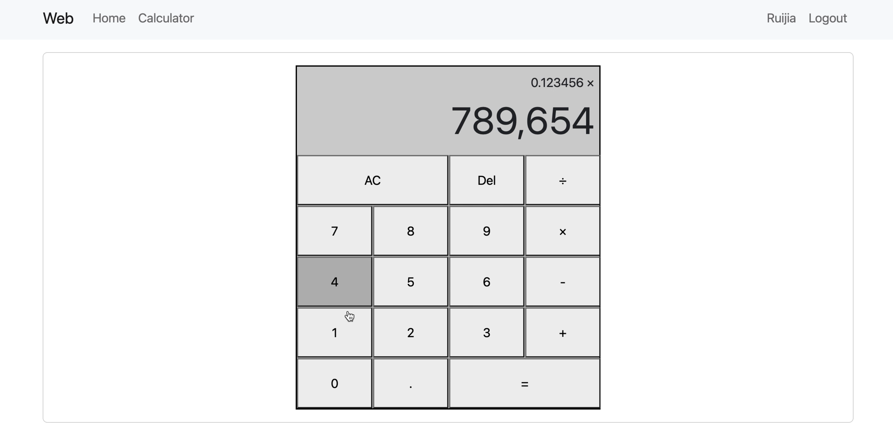
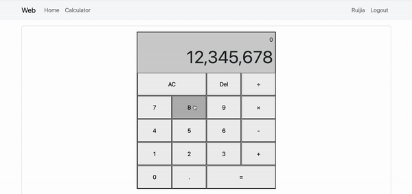
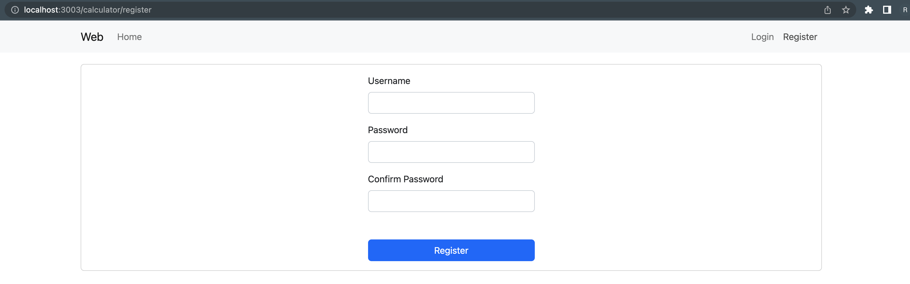
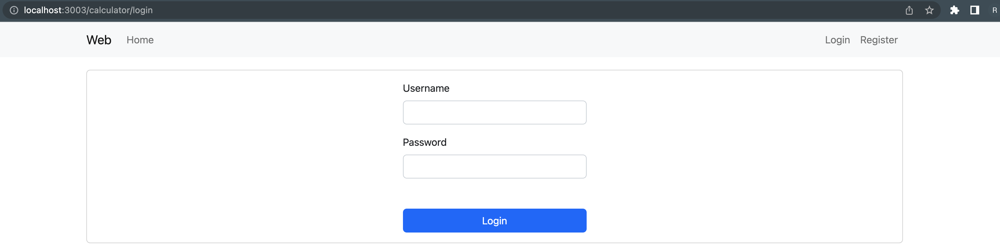

<h1 align="center">Calculator</h1>

<p align="center">
  


</p>



<h2 align="center"><a href="https://youtu.be/n1NnPR9G1_s">View a Demo</a></h2>

## Description

<p align="center">
</p>

Implemented a calculator from scratch using React, with Redux managing state since the components frequently interact. It imitates the Windows calculator style and realizes basic calculator functionality by considering more than a dozen exceptional cases. If the backend APIs are plugged into this web page, it will instantly have registration, login, logout and non-login redirection functions. The project does not have connections to back-end APIs, so the page is always logged in to make the calculator page accessible.

## How to use

- Click Calculator in the navigation bar and use the calculator by clicking the button.

## About the project

### CSS
- Used Grid Layout and Flexbox to implement button section and numeric display area, respectively, imitating Windows calculator.

### Calculator Logic Design

- **States to be maintained**
  - currentOperand
  - lastOperand
  - operation
  - overWrite(New input overwrites the previous evaluation result.)

- **Actions**
  - add-digit
  - delete-digit
  - choose-operation
  - clear
  - evaluate

- **Reusable components for the calculator page**
  - `digitButton.jsx`: The decimal point and the number 0 to 9 buttons are abstracted into the digitButton component.
  - `operationButton.jsx`: The addition, subtraction, multiplication and division operators are abstracted into the operationButton component.

### Redux

- `action.js`: Using strings to represent the action type is easy to maintain.
- `reducer.js`: The results are calculated based on the values of the three states, so they are not independent, using a reducer to update all the states.
- `store.js`: Build a state tree.

### React Redux
- Used Redux to query state, change state, and propagate state changes in a single store to better manage the four states that are interrelated and frequently updated, avoiding multiple levels of components passing data and reducing re-renders.

## Exceptional Cases

### First repeated 0
- If both `currentOperand` and action.digit ( currently clicked number ) are 0, no more 0 can be entered, so states do not change.

### 0 is replaced by other numbers
- When `currentOperand` is 0 unless the current input is a decimal point and the first 0 remains unchanged, in other cases, the first 0 needs to be replaced directly with the value of the current click, and the other states are unchanged.

### Repeat input decimal point
- If `currentOperand` already contains a decimal point, you cannot enter it again.

### `.` to `0.`
- If `currentOperand` is empty, `0.` is displayed when clicking the decimal point.

### Delete operation in three cases
- When `currentOperand` is empty, click Delete, states are unchanged.
- When `currentOperand` is not empty and the display is not the result of calculation, only the last bit of `currentOperand` is deleted when you click Delete.
- If `currentOperand` is not empty and the display is the result of calculation, click Delete to clear `currentOperand`.

### Unable to check operator
- When both `lastOperand` and `currentOperand` are blank, the operators cannot be checked.
  
### Operators in effect
- When `lastOperand` is empty, click operators, `currentOperand` is transferred to `lastOperand`, clear `currentOperand`, and the effective operator is displayed next to `lastOperand`.

### Modify wrong operator
- When `currentOperand` is empty and `lastOperand` is not empty, click on operators to modify the current operator.

### Continuous Operations
- When `lastOperand`, `operation`, and `currentOperand` are not empty, click the operator, `lastOperand` is the current calculation result, `operation` shows the new operator, and `currentOperand` is cleared.

### Clear
- Clear `lastOperand`, `operation`, and `currentOperand`.

### Calculate the result
- When `lastOperand`, `operation`, and `currentOperand` are not empty, `currentOperand` will be updated as the result of the calculation, and `lastOperand` and `operation` will be cleared.

### Thousands separator
- `Intl.NumberFormat('en-US').format(number)`
- Three decimal places are automatically retained.

### Cancel decimal formatting
- Write functions to achieve only formatting the integer part.

## Implemented registration, login and logout

<p align="center">

</p>

<p align="center">

</p>

### Redirection
- Accessing the calculator page by modifying the URL while not logged in will redirect you to the login page.
- Accessing the login and registration pages by modifying the URL while logged in will redirect you to the home page.
  ```html
  <Routes>
    <Route path='/calculator' element={<Home />} />
    <Route path='/calculator/home' element={<Home />} />
    <Route path='/calculator/calculator' element={this.state.is_login ? <Calculator /> : <Navigate replace to="/calculator/login" />} />
    <Route path='/calculator/login' element={this.state.is_login ? <Navigate replace to="/calculator" /> : <Login />} />
    <Route path='/calculator/register' element={this.state.is_login ? <Navigate replace to="/calculator" /> : <Register />} />
    <Route path='/calculator/404' element={<NotFound />} />
    <Route path="/calculator*" element={<Navigate replace to="/calculator/404" />} />
  </Routes>
  ```
### Reserved front-end interfaces
- If the backend APIs are plugged into this web page, it will instantly have registration, login, logout and non-login redirection functions. 
- The project does not have connections to back-end APIs, so the page is always logged in to make the calculator page accessible.
- Example: Set mouse event listener, send registration request to the backend, and redirect to the home page if registration is successful.
  
  ```js
  handleClick = e => {
    e.preventDefault();

    if (this.state.username === "")
        this.setState({ error_message: "Username cannot be empty" });
    else if (this.state.password === "")
        this.setState({ error_message: "Password cannot be empty" });
    else if (this.state.password_confirm === "")
        this.setState({ error_message: "Confirming password is required" });
    else if (this.state.password_confirm !== this.state.password)
        this.setState({ error_message: "The passwords you typed do not match" });
    else {
        $.ajax({
            url: "",  // register
            type: "get",
            data: {
                username: this.state.username,
                password: this.state.password,
                password_confirm: this.state.password_confirm,
            },
            dataType: "json",
            success: resp => {
                if (resp.result === "success")
                    window.location.href = "/calculator";
                else
                    this.setState({ error_message: resp.result });
            },
        });
    }
  ```

## Project setup
- Download this project
- Install Node.js
- Install npm
- Go to this project folder
- `npm start`

## Future scope

- Realize negative numbers.
- Handle division exceptional cases.
- Add exponential operations, square roots, and logarithms.
